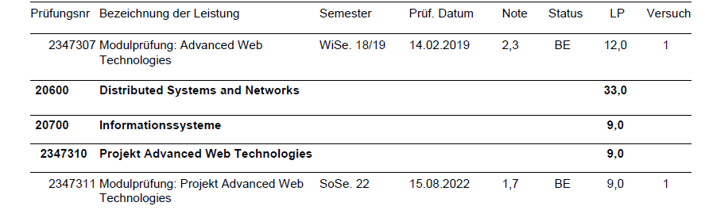
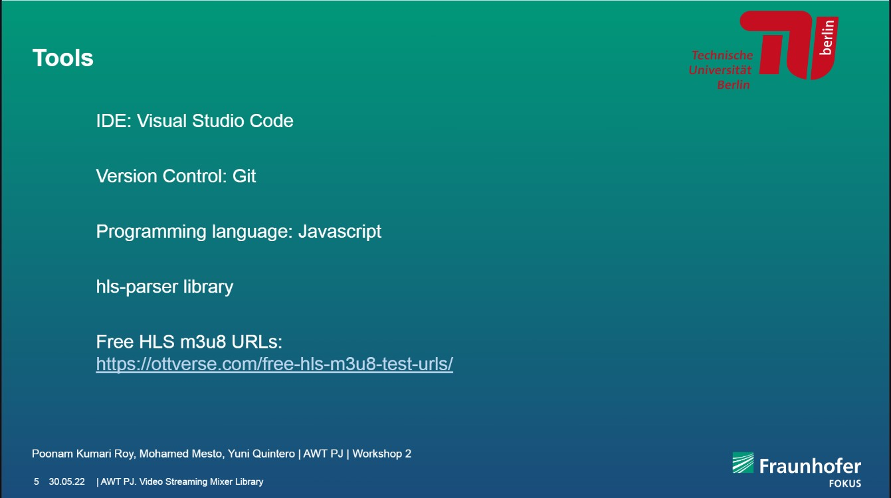
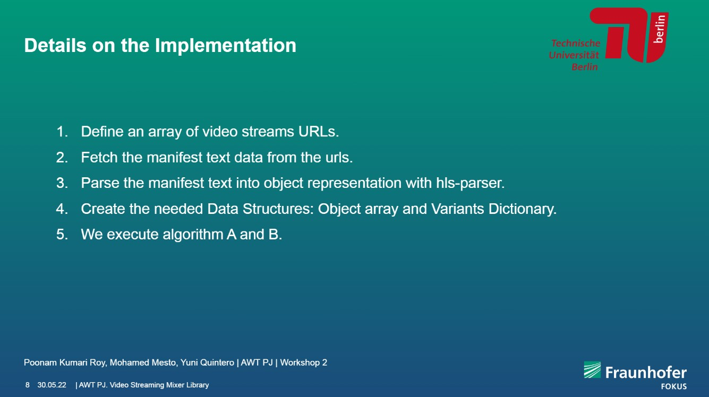

<table border=0>
<tr border=0>
<td>  </td>
  <td align="center"> <h5><a href="https://www.fokus.fraunhofer.de/en">by Fraunhofer Institute for Open Communication Systems (Fokus) Institute.</a></h5> </td>
  <td>  </td>
</tr>
<tr border=0>
<td> </td><td  align="center"> <h5> Project Topic </h5> </td><td> </td>
</tr>
<tr border=0>
<td> </td><td> </td><td> </td>
</tr>
  <tr>
    <td> </td>
<td align="center"><h5><a href="https://github.com/fraunhoferfokus">"Video Streaming Mixer Library"</a></h5></td>
    <td> </td>
</tr>
  <tr>
    <td> </td>  <td align="center"><a href='https://www.linkedin.com/in/alexander-futasz/'> Ph.D. Student Eng. Alexander Futász</a></td>
    <td> </td>
</tr>
</table>

# Advanced Web Technologies Project summersemester 2022 - Group 1
# Video Streaming Mixer Library
by Fraunhofer-Institut für Offene Kommunikationssysteme FOKUS.

Video Streaming Mixer Library: In order to create e.g. playlists consisting of multiple existing different video streams it is needed to make sure that the different video stream sources are all compatible in regards to video resolution and bitrate and can be combined into a single video stream.

## Installation

This library was developed in Node JS. To use the methods developed, an external Node JS app has to be created to use the video mixer library as a dependency.

Create your own Node JS application: https://code.visualstudio.com/docs/nodejs/nodejs-tutorial, then run the following command to install the video mixer library:

```npm i awt-pj-ss22-video-streaming-mixer-library-1```

within your main.js file, import the algorithmA and algorithmB methods:

```const {algorithmA, algorithmB} = require('awt-pj-ss22-video-streaming-mixer-library-1')```

call ```algorithmA([urls])``` or ```algorithmB([urls])``` methods where ```[urls]``` is an array of strings made from different streams urls

then, run the methods in the command line:

```node main.js```

In order to see the final output video, have a localhost server running in your Node application directory, as follows:
```
cd [node app directory]
python3 -m http.server
```

Then, on Safari browser or a Google Chrome Extension that supports HLS files, type localhost:8000/master.m3u8 to see the results.

## Figures
the figures are created via Draw.io

## Contributors
- Mohamed Mesto, m.mesto@campus.tu-berlin.de , Mohamedmesto111@gmail.com
- Yuni Amaloa Quintero Villalobos, Quintero.villalobos@campus.tu-berlin.de
- Poonam Kumari Roy, Poonam.k.roy@campus.tu-berlin.de

## Evaluation Grade from Quality and Usability Lab
1.7



## License & copyright
© Yuni Amaloa Quintero Villalobos, Poonam Kumari Roy and Mohamed Mesto
License under the [MIT License] (LICENSE).





